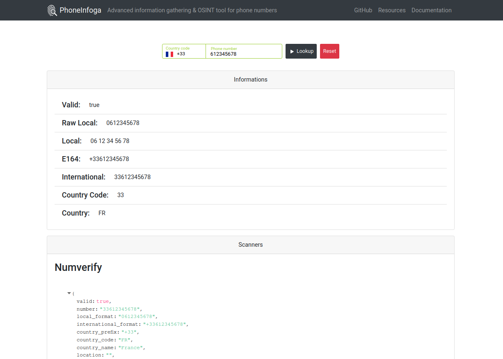

<div align="center">

  

  # 📱 PhoneInfoga

  **Advanced Information Gathering & OSINT Reconnaissance Framework for Phone Numbers**

  <p align="center">
    <a href="https://github.com/Aditya1791/PhoneNoInfo/actions"></a>
    <a href="https://goreportcard.com/report/github.com/Aditya1791/PhoneNoInfo/v2"></a>
    <a href="https://hub.docker.com/r/Aditya1791/PhoneNoInfo"></a>
    <a href="https://github.com/Aditya1791/PhoneNoInfo/releases"></a>
    <a href="./LICENSE"></a>
  </p>

  ### 🌐 Connect & Socials

  <p align="center">
    <a href="https://github.com/Aditya1791" target="_blank">
      
    </a>
    <a href="https://linkedin.com/in/aditya-ranjan-swain" target="_blank">
      
    </a>
    <a href="https://twitter.com/Monkey_D_Adi" target="_blank">
      
    </a>
    <a href="https://facebook.com/Aditya1791" target="_blank">
      
    </a>
    <a href="mailto:swainaditya85@gmail.com" target="_blank">
      
    </a>
  </p>

  <p align="center">
    <a href="https://sundowndev.github.io/phoneinfoga/"><strong>Explore the Docs »</strong></a>
    <br />
    <br />
    <a href="https://petstore.swagger.io/?url=https://raw.githubusercontent.com/sundowndev/phoneinfoga/master/web/docs/swagger.yaml">API Reference</a>
    ·
    <a href="https://github.com/sundowndev/phoneinfoga/issues">Report Bug</a>
    ·
    <a href="https://github.com/sundowndev/phoneinfoga/discussions">Request Feature</a>
    ·
    <a href="https://medium.com/@SundownDEV/phone-number-scanning-osint-recon-tool-6ad8f0cac27b">Read Blog Post</a>
  </p>

</div>

---

## 📑 Table of Contents

- [About The Project](#-about-the-project)
- [Key Features](#-key-features)
- [Ethical Use & Anti-Features](#-ethical-use--anti-features)
- [Architecture & Tech Stack](#-architecture--tech-stack)
- [Quick Start & Installation](#-quick-start--installation)
  - [Docker (Recommended)](#1-using-docker-recommended)
  - [Pre-compiled Binary](#2-pre-compiled-binary)
  - [Build From Source](#3-build-from-source)
- [Usage Guide](#-usage-guide)
  - [CLI Scanning](#cli-scanning)
  - [Web GUI & REST API](#web-gui--rest-api)
- [Available Scanners & OSINT Modules](#-available-scanners--osint-modules)
- [Configuration](#-configuration)
- [Extensibility & Plugins](#-extensibility--plugins)
- [Contributing](#-contributing)
- [License](#-license)

---

## 🔎 About The Project

**PhoneInfoga** is one of the most advanced open-source intelligence (OSINT) tools dedicated to scanning and gathering information on international phone numbers.

It operates in a modular two-step reconnaissance workflow:
1. **Normalization & Local Validation**: Statically parses international phone numbers according to the E.164 standard, extracting country codes, area codes, original line formats, and carrier specifications.
2. **Digital Footprinting & OSINT**: Queries telecom registries, external APIs, search engine dorks, and digital footprints to locate VoIP providers, reputations, and associated public records.

<div align="center">
  
</div>

---

## ✨ Key Features

- 🌍 **International Number Validation**: Verifies phone number existence, formats (E.164, International, National, RFC3966), and geographic coordinates.
- 📡 **Carrier & Line Type Extraction**: Discovers carrier metadata and determines line types (Mobile, Landline, VoIP, Toll-free).
- 🔍 **OSINT Footprinting**: Employs Google search dorks, Google Custom Search Engine (CSE), and telecom databases.
- 🌐 **Modern Web UI**: Features a clean, responsive single-page application built with Vue.js embedded directly into the Go binary.
- 🔌 **High-Performance REST API**: Full OpenAPI / Swagger-documented endpoints for integration into security pipelines.
- 🧩 **Custom Scanner Plugins**: Extensible Go plugin architecture to create and hook proprietary scanning modules.
- 📦 **Zero-Dependency Deployment**: Compiles into a single standalone binary or lightweight Alpine Docker container.

---

## 🛡️ Ethical Use & Anti-Features

PhoneInfoga is designed purely for reconnaissance, intelligence gathering, and security auditing using **publicly available resources**.

- ❌ **Does NOT track** a phone or its owner in real time.
- ❌ **Does NOT locate** exact GPS / physical coordinates.
- ❌ **Does NOT intercept** messages or hack cellular devices.
- ⚠️ **Data Disclaimer**: Results rely on public databases and search engine indices; accuracy depends on third-party data availability.

---

## 🛠️ Architecture & Tech Stack

| Component | Technology | Purpose |
| :--- | :--- | :--- |
| **Backend Core** | [Go (Golang)](https://go.dev/) | CLI engine, concurrent scanning pipeline, and REST API |
| **Web Server** | [Gin Web Framework](https://gin-gonic.com/) | High-performance routing, middleware, and asset serving |
| **Frontend UI** | [Vue.js](https://vuejs.org/) + [BootstrapVue](https://bootstrap-vue.org/) | Responsive web client embedded into Go binary via `embed.FS` |
| **API Specs** | [Swagger / OpenAPI 2.0](https://swagger.io/) | Auto-generated REST API documentation |
| **Packaging** | [Docker (Alpine Linux)](https://www.docker.com/) | Containerized zero-dependency execution |

---

## 🚀 Quick Start & Installation

### 1. Using Docker (Recommended)

Run PhoneInfoga immediately without installing any language runtimes:

```bash
# Pull and run help
docker run --rm -it sundowndev/phoneinfoga --help

# Run a CLI scan
docker run --rm -it sundowndev/phoneinfoga scan -n "+14155552671"

# Launch the Web GUI & REST API on port 5000
docker run --rm -it -p 5000:5000 sundowndev/phoneinfoga serve
```

### 2. Pre-compiled Binary

Download the latest binary release for your operating system from the [Releases Page](https://github.com/sundowndev/phoneinfoga/releases):

```bash
# Extract and move to PATH (Linux/macOS)
tar -xvzf phoneinfoga_*.tar.gz
sudo mv phoneinfoga /usr/local/bin/

# Verify installation
phoneinfoga version
```

### 3. Build From Source

Requirements: **Go 1.20+** and **Node.js 18+**

```bash
# 1. Clone repository
git clone https://github.com/sundowndev/phoneinfoga.git
cd phoneinfoga

# 2. Build web client
cd web/client
yarn install && yarn build
cd ../..

# 3. Build binary
go build -o bin/phoneinfoga .
```

---

## 💻 Usage Guide

### CLI Scanning

Scan any international phone number with standard E.164 notation:

```bash
# Basic scan
phoneinfoga scan -n "+14155552671"

# Scan with specific scanners only
phoneinfoga scan -n "+33679368229" -s local -s ovh

# Drop specific scanner from the pipeline
phoneinfoga scan -n "+447911123456" --disable googlesearch
```

### Web GUI & REST API

Launch the interactive web client:

```bash
# Start server on default port 5000
phoneinfoga serve

# Start on custom port
phoneinfoga serve -p 8080

# Run in REST API only mode (headless)
phoneinfoga serve --no-client -p 5000
```

Once running, access the web client at:
👉 **`http://localhost:5000`**

Explore interactive REST API docs at:
👉 **`http://localhost:5000/swagger/index.html`**

---

## 🔍 Available Scanners & OSINT Modules

| Scanner | Description | Requirements |
| :--- | :--- | :--- |
| **`local`** | Performs offline international formatting, country detection, carrier mapping, and timezones. | None (Built-in) |
| **`numverify`** | Queries Numverify API for validation, line type (mobile/landline), and carrier info. | `NUMVERIFY_API_KEY` |
| **`ovh`** | Discovers telecom operator and line allocation metadata from OVH telecom registry. | None (Free) |
| **`googlesearch`** | Generates Google search dorks to detect disposable numbers, social accounts, and reputation. | None (Web Dorking) |
| **`googlecse`** | Automates Google searches via the official Custom Search Engine API. | `GOOGLE_API_KEY` & `GOOGLECSE_CX` |

---

## ⚙️ Configuration

Set your API keys inline or create a `.env` file in your root workspace:

```env
# Numverify API (https://numverify.com/)
NUMVERIFY_API_KEY="your_api_key_here"

# Google Custom Search API (https://developers.google.com/custom-search/v1/overview)
GOOGLE_API_KEY="your_google_api_key_here"
GOOGLECSE_CX="your_search_engine_cx_here"
```

Pass custom configuration files directly to scans:

```bash
phoneinfoga scan -n "+14155552671" --env-file .env.custom
```

---

## 🧩 Extensibility & Plugins

Write custom scanner modules in Go and load them dynamically during scans:

```bash
phoneinfoga scan -n "+14155552671" --plugin ./plugins/custom_scanner.so
```

Check the [`examples/`](./examples) directory for starter templates on building custom scanner plugins.

---

## 🤝 Contributing

Contributions make the open-source community an amazing place to learn, inspire, and create. Any contributions you make are **greatly appreciated**!

1. Fork the Project
2. Create your Feature Branch (`git checkout -b feature/AmazingFeature`)
3. Commit your Changes (`git commit -m 'Add some AmazingFeature'`)
4. Push to the Branch (`git push origin feature/AmazingFeature`)
5. Open a Pull Request

Please review our [Contributing Guidelines](./docs/contribute.md) and [Code of Conduct](./CODE_OF_CONDUCT.md).

---

## 📄 License

Distributed under the **GNU General Public License v3.0**. See [`LICENSE`](./LICENSE) for more information.

<div align="center">
  <sub>Built with ❤️ by <a href="https://github.com/sundowndev">Sundowndev</a> and the Open Source Community.</sub>
</div>
